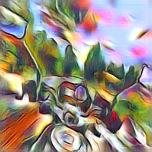
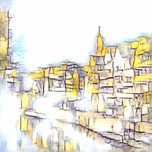

#  Fast Patch-based Style Transfer of Arbitrary Style

This is a Pytorch implementation of the [Fast Patch-based Style Transfer of Arbitrary Style](https://arxiv.org/abs/1612.04337).

Given a content image an an arbitary style image, this program attempts to transfer the style features by swapping the style patches.

## Style Swap

$\Phi(\cdot)$ is the function represented by a fully convolutional part of a pretrained VGG19 that maps an image from RGB to some intermediate activation space. So $\Phi(C)$ is the activation of content, and $\Phi(S)$ is the activation of style.

Extract a set of patches $\phi_i(c), \phi_j(s)$ for  $\Phi(C), \Phi(S)$. The target of "Style Swap" is to find a closest-matching style patch for each content patch, and replace it. 


## Usage

`python main.py train ARGS`

Possible ARGS are:

    contentPath = "./images/content"   # Path of directory containing content images to be transformed
    
    stylePath = "./images/style"       # Path of directory containing style images to be transformed
    
    img_hsize = 256                     # Reshape the image to have new size
    img_wsize = 256
    patch_size = 3                     # Patch size of the style swap
    relu_level = 3                     # Style swapping in different layers of VGG19
    max_epoch = 2                      # Numbers of iterations
    minibatch = 2                      # The batch size of each training
    lambda_weight = 1e-5               # The weight of the total variation regularization
    lr = 1e-2                          # The learning rate of Adam
    beta1 = 0.9                        # The parameter of Adam_beta1
    gpu = True                         # Flag to enables GPU to accelerate computations
    out_dir = './outputs'              # Path of the directory store stylized images
### Stylizing images:

```
python main.py train --contentPath ./images/content/ --stylePath./images/style
```

### Examples:






