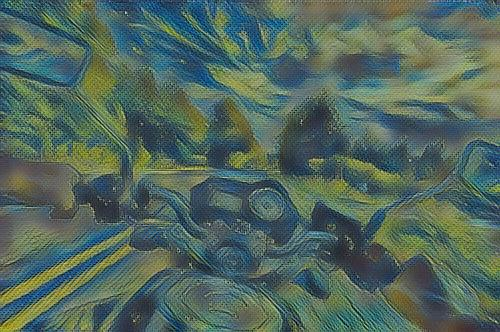
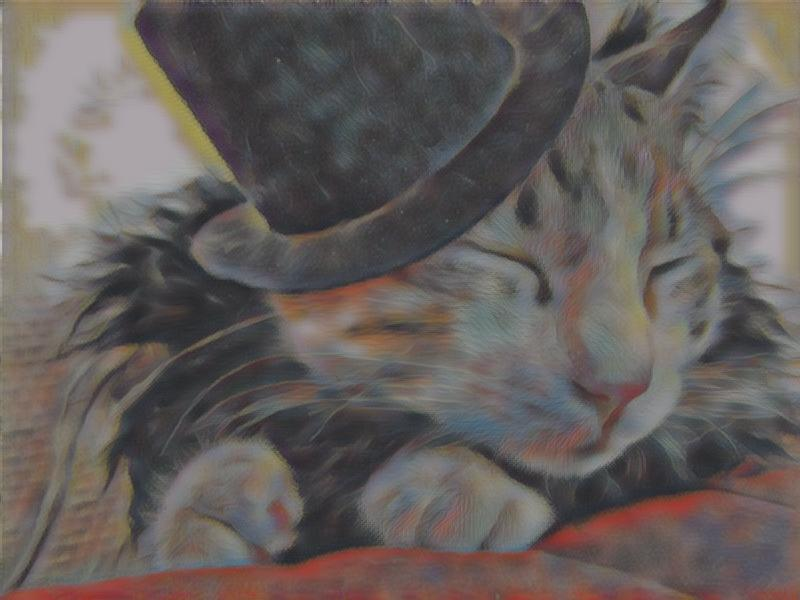

#  Fast Patch-based Style Transfer of Arbitrary Style

This is a Pytorch implementation of the [Fast Patch-based Style Transfer of Arbitrary Style](https://arxiv.org/abs/1612.04337).

Given a content image an an arbitary style image, this program attempts to transfer the style features by swapping the style patches.

## Style Swap

$\Phi(\cdot)$ is the function represented by a fully convolutional part of a pretrained VGG19 that maps an image from RGB to some intermediate activation space. So $\Phi(C)$ is the activation of content, and $\Phi(S)$ is the activation of style.

Extract a set of patches $\phi_i(c), \phi_j(s)$ for  $\Phi(C), \Phi(S)$. The target of "Style Swap" is to find a closest-matching style patch for each content patch, and replace it. 


## Usage

If you want to visualize the loss of training process, you need to type `python -m visdom.server` to open visdom.

`python main.py train ARGS`

Possible ARGS are:

```
content = "./images/content"       # Path of directory containing content images to be transformed

style = "./images/style"           # Path of directory containing style images to be transformed

img_size = 256                     # Reshape the image to have new size
patch_size = 3                     # Patch size of the style swap
relu_level = 3                     # Style swapping in different layers of VGG19
max_epoch = 4                      # Numbers of iterations
minibatch = 2                      # The batch size of each training
tv_weight = 1e-6                   # The weight of the total variation regularization
lr = 1e-3                          # The learning rate of Adam
gpu = True                         # Flag to enables GPU to accelerate computations
out_dir = './outputs'              # Path of the directory to store stylized images
save_dir = './save_models'         # Path of the directory to store models
vis = True                         # Use visdiom
```

### Stylizing images:

```
python main.py train --content ./images/content/ --style ./images/style
python main.py train --content ./COCO_Mikiart/COCO/ --style ./COCO_Mikiart/Mikiart

python main.py test --content ./images/content/bike.jpg --style ./images/style/starry_night.jpg
python main.py test --content ./images/content/gentlecat.png --style ./images/style/woman-with-hat-matisse.jpg
python main.py test --content ./images/content/sailboat.jpg --style ./images/style/sketch.jpg
```

### Examples:






